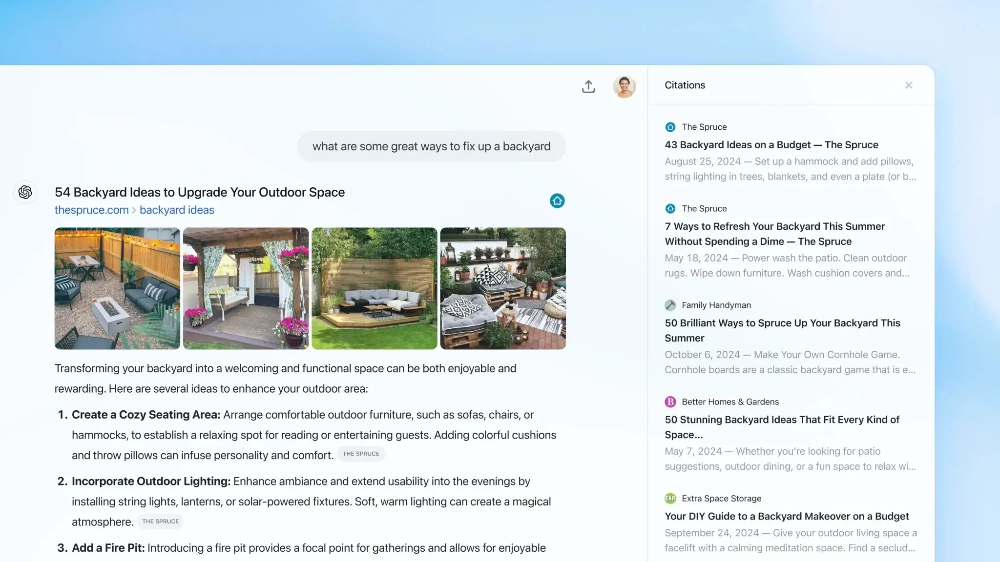
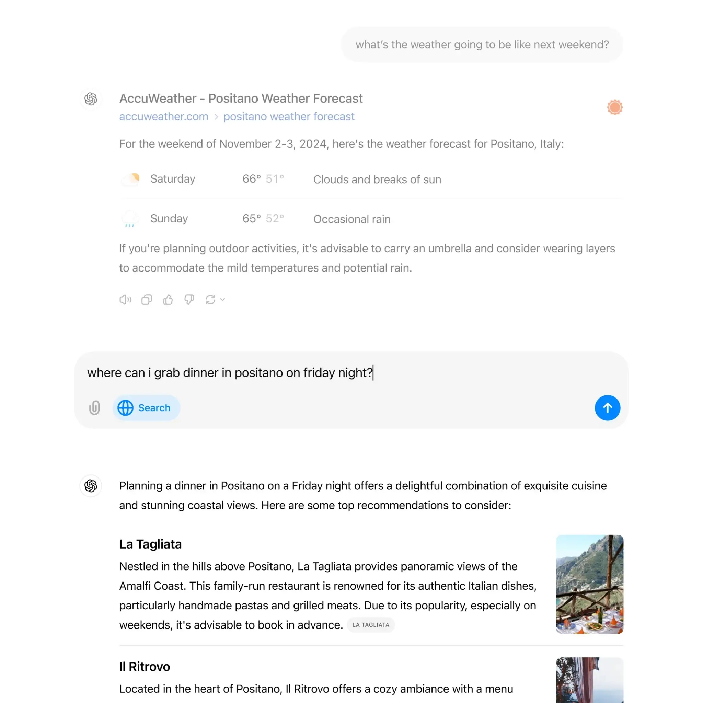

לאחר השקה מצומצמת כ-SearchGPT, השיקה היום OpenAI את ChatGPT Search. זהו האתגר המשמעותי ביותר לגוגל בשנים האחרונות, עם יכולות חיפוש מרשימות.

## זמינות של ChatGPT Search

ChatGPT Search זמין כיום באתר [chatgpt.com](https://chatgpt.com/) וניתן להשתמש בו גם באפליקציות ל-iOS ול-Mac.

נכון לעכשיו, הגישה זמינה למנויים משלמים ולמי שהיה ברשימת ההמתנה של SearchGPT, אך זה ישתנה בקרוב. משתמשי ChatGPT Plus ו-Team מקבלים גישה כעת, משתמשי Enterprise ו-Edu בשבועות הקרובים, ולבסוף כל משתמשי Free ואפילו משתמשים שאינם מחוברים יקבלו גישה במהלך החודשים הבאים.

## איך עובד ChatGPT Search

בעוד שחלק מהמשתמשים השתמשו ב-ChatGPT באופן דומה למנוע חיפוש, הוא מעולם לא נבנה למטרה הזו — עד עכשיו.

עם ChatGPT Search, OpenAI ביצעה שדרוגים ייעודיים שמספקים תכונות שכולנו מצפים למצוא במנועי חיפוש כמו גוגל.

כך OpenAI מסבירה את השינוי:

**_כעת, ChatGPT מסוגל לחפש באינטרנט בצורה הרבה יותר טובה. ניתן לקבל תשובות מהירות ומעודכנות עם קישורים למקורות רלוונטיים, דבר שבעבר דרש מעבר למנוע חיפוש. התכונה הזו משלבת את היתרונות של ממשק שפה טבעי עם ערך המידע העדכני, כמו תוצאות ספורט, חדשות, מחירי מניות ועוד._**

**_ChatGPT יבחר לבצע חיפוש באינטרנט לפי השאלה שלך, או שניתן לבחור חיפוש ידני על ידי לחיצה על אייקון החיפוש באינטרנט._**

OpenAI יצרה שותפויות עם ספקי חדשות ונתונים כדי לספק מידע בזמן אמת ולהציג אותו בעיצובים ייחודיים לסוגי תוכן מסוימים.

לדוגמה, חיפושים יציגו עיצובים מיוחדים כאשר תוצאות כוללות תוצאות ספורט, כתבות חדשותיות, מניות, מזג אוויר ומפות.

חשוב לציין כי כעת שיחות ב-ChatGPT כוללות קישורים למקורות, כך שתוכל לחקור בעצמך את החומרים המקוריים שממנו המידע נלקח.

## האתגרים של OpenAI

בעוד שההשקה מצופה בהתלהבות, עולות כמה שאלות חשובות. ראשית, נושא האמינות והשקיפות של המקורות. OpenAI טוענת כי חתמה על הסכמי רישוי עם מוציאים לאור ומקורות נתונים שונים, אך טיב השותפויות הללו אינו ברור

נושא נוסף הוא הפריסה ההדרגתית של השירות – תחילה למנויי Plus ו-Team, לאחר מכן ללקוחות עסקיים ומוסדות חינוך, ולבסוף למשתמשים חינמיים.

היבט מדאיג יותר הוא ההשפעה הפוטנציאלית על עולם התקשורת המקוונת. מחקר מצביע על כך שתצוגות מקדימות שנוצרות על ידי AI עלולות להפחית את התעבורה לאתרי חדשות ב-25%. "קניבליזציה" זו מהווה איום ממשי עבור מוציאים לאור רבים.

OpenAI הודיעה כי בכוונתה להמשיך ולשפר את מנוע החיפוש, במיוחד בתחומים כמו קניות ונסיעות, תוך שימוש במודלים מסוג "הסקת מסקנות" מסוג o1 למחקרים מעמיקים יותר. החברה מתכננת גם לשלב את _ChatGPT Search_ במצב הקולי המתקדם שלה.

- אמינות ושקיפות מקורות: OpenAI שואפת לשתף פעולה עם ספקי מידע, אך שותפויות אלו עדיין לא ברורות.
- איום על אתרי חדשות: תצוגות מקדימות של AI עלולות להפחית את התנועה לאתרי חדשות ב-25%, דבר המאיים על מפרסמים רבים.
- למרות שהכור אינו יוצר היתוך אמיתי, ההישג הזה עשוי לעורר גישות חדשות במחקר על אנרגיה נקייה.
