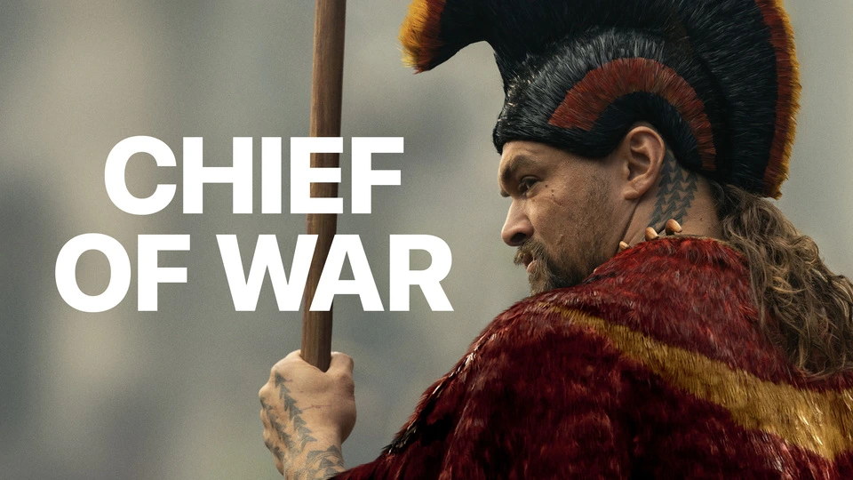
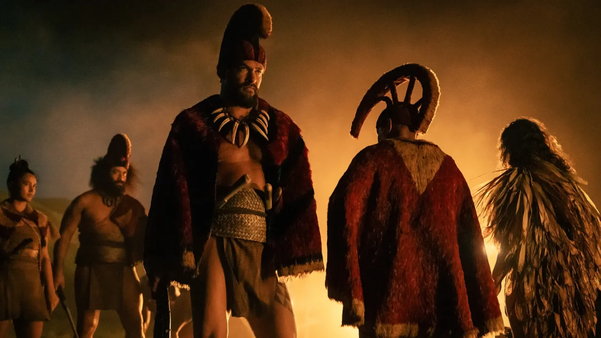

**סדרה חדשה, שפה ויזואלית חדשה – אבל אותו שחקן ראשי שכבר הרשים אותנו.**

_Chief of War_ היא סדרת הדרמה ההיסטורית החדשה של Apple TV+, שתעלה ב־1 באוגוסט 2025, בכיכובו של **Jason Momoa** – שכבר כיכב בעבר בסדרת _See_ של Apple, סדרה שזכתה **לאהדת הקהל והמערכת כאן ב־Techhorizons**.

כעת הוא חוזר, לא רק כשחקן אלא גם כיוצר שותף, עם סיפור שלא סופר עדיין על המסך.

## **עלילת הסדרה: גיבור הוואי במאבק לאומי**

_Chief of War_ מגוללת את סיפורו של **Ka‘iana** – לוחם הוואי כריזמטי, שנקלע לעימותים הפוליטיים, החברתיים והצבאיים במאה ה־18, רגע לפני בוא הקולוניאליזם המערבי.

בזמן שמנהיגים שונים מנסים לאחד את איי הוואי, Ka‘iana צריך להחליט – האם להילחם למען עמו, או לשמור על חירותו.

## **הפקה שמכבדת את המקור – מבפנים**

את הסדרה יצרו **Jason Momoa** ו־**Thomas Pa‘a Sibbett**, שניהם ממוצא פולינזי.  
הצוות כולל שחקנים בעלי שורשים מהאזור:

- **Luciane Buchanan**
    
- **Temuera Morrison** (_The Book of Boba Fett_)
    
- **Cliff Curtis** (_Avatar: The Way of Water_)
    

שני הפרקים הראשונים בוימו על ידי **Justin Chon**, ואת הפרק האחרון מביים **Momoa** בעצמו.  
את הפסקול הלחינו **Hans Zimmer** ו־**James Everingham** – שילוב שמבטיח עומק רגשי, תרבותי וקולנועי.

## **צפו בטריילר הרשמי**

הטריילר חושף סצנות פעולה מרשימות, נופים טבעיים עוצרי נשימה, וקונפליקט פנימי שמוביל את הסדרה הרחק מהדימוי הקלאסי של סדרות פעולה. זו דרמה עם שורשים.

https://www.youtube.com/watch?v=-VIAsu\_G7so&ab\_channel=AppleTV

## **קונטקסט חשוב: למה זה שונה?**

Apple TV+ מציגה כאן **נרטיב היסטורי מהצד הפולינזי**, ולא מהזווית המערבית הרגילה.  
זהו ניסיון להאיר רגע מכריע בהיסטוריה – על רקע כיבוש, התנגדות וזהות לאומית.

והכי חשוב: **הקול המקומי במרכז**, ולא כקישוט.

## **שידור וזמינות**

- **השקה**: 1 באוגוסט 2025 (שני פרקים ראשונים)
    
- **פרקים שבועיים**: עד 19 בספטמבר
    
- **פלטפורמה**: Apple TV+ (9.99 דולר לחודש)
    

## **מומלץ במיוחד למי שאהב את See – אבל רוצה עומק היסטורי**

אם התחברתם ל־_See_ בזכות האווירה הייחודית והנוכחות של Jason Momoa, _Chief of War_ לוקחת את אותו DNA ומוסיפה לו נגיעה ביוגרפית ותרבותית.

ב־Techhorizons אהבנו את מה שראינו עד כה – ונמשיך לעקוב.
