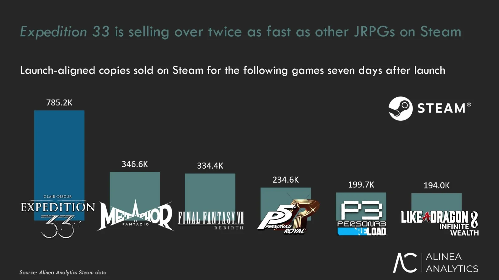
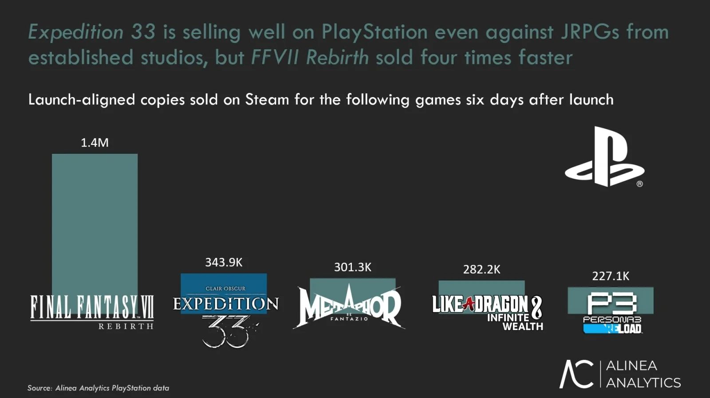

האם משחק תפקידים צרפתי יכול לנצח את Final Fantasy? כנראה שכן.  
**Clair Obscur: Expedition 33**, מבית Sandfall Interactive, שובר שיאים – ונמכר בקצב **כפול** מכל JRPG אחר ב־Steam, כולל כותרים כמו **Final Fantasy VII Rebirth** ו־**Metaphor: ReFantazio**.

וזה למרות שהוא זמין גם ב־Game Pass.

## **מיליון עותקים – עם תג מחיר נמוך**

המשחק נמכר כבר בלמעלה מ־**מיליון עותקים**, לפי הנתונים הרשמיים של Kepler Interactive. מדובר בעותקים שנרכשו בפועל – לא רק הורדות או הפעלות.  
לפי Rhys Elliott, ראש מחלקת ניתוח שוק ב־Alinea Analytics:

> “המחיר הנמוך תרם משמעותית. השוואה לנתוני Steam מראה שרבים רוכשים משחקים AAA כשהם יורדים מ־50 דולר – וזה עבד פה בגדול.”

## **בפלייסטיישן – Final Fantasy עדיין מוביל**

בזירת הקונסולות, **Final Fantasy VII Rebirth** עדיין רץ קדימה עם מכירות גבוהות פי 4 בשבוע ההשקה.  
אבל Clair Obscur שומר על קצב טוב ומקדים את כל שאר המתחרים בז'אנר.

## **המהפכה השקטה: קרב תור־תור, גרפיקה ריאליסטית**

הצלחה כזו היא לא רק מסחרית – היא גם רעיונית.  
Clair Obscur מוכיח שיש מקום לקרבות **תור־תור מודרניים**, אפילו עם גרפיקה ריאליסטית ועיצוב בוגר.  
וזה בניגוד לדברים שאמר מפיק Final Fantasy XVI, נאוקי יושידה, שטען ש"קרבות תוריים וגרפיקה ריאליסטית יוצרים דיסוננס".

המשחק משלב **קרבות תוריים עם אלמנטים בזמן אמת** כמו התחמקויות, בלוקים ופרי – והקהל עף על זה.

## **למה כולם מדברים על Clair Obscur?**

ביקורת באתר Wccftech נתנה למשחק **9.5 מתוך 10**, וציינה:

> “לא הכי חדשני, אבל אחד המשובחים. מסע רגשי, כתיבה נהדרת, קרבות כיפיים, ואווירה קולנועית. לגמרי מועמד למשחק השנה.”

## **לסיכום – מה Clair Obscur עושה נכון?**

| אלמנט | למה זה בול בזמן |
| --- | --- |
| 🎮 קרבות תור־תור חכמים | מחזירים את הפשטות עם חידושים רעננים |
| 🎨 גרפיקה ריאליסטית | מה שמעריצים רצו מאז שנות ה־2000 |
| 💰 מחיר נגיש | פחות מ־50 דולר – גם ל־AAA |
| 📈 הצלחה ב־Steam | פי 2 מכל JRPG אחר |
