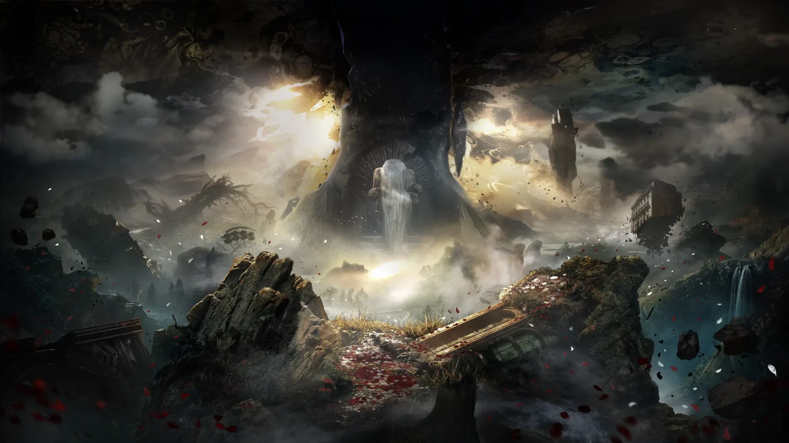
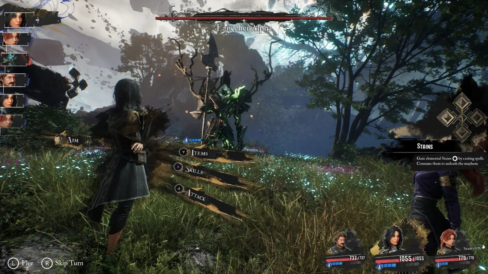
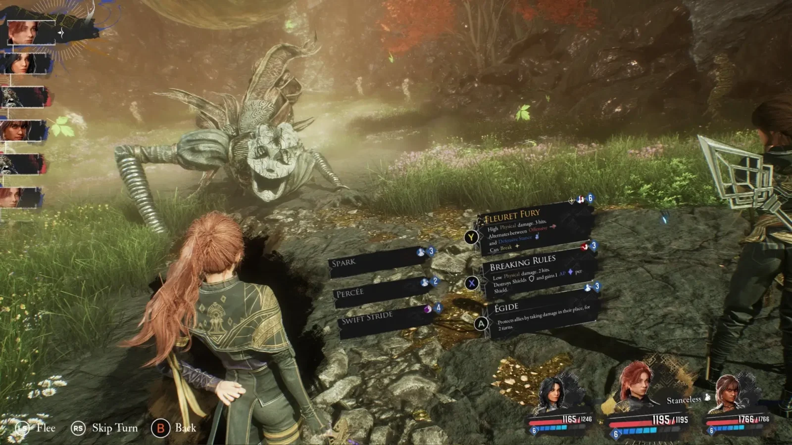
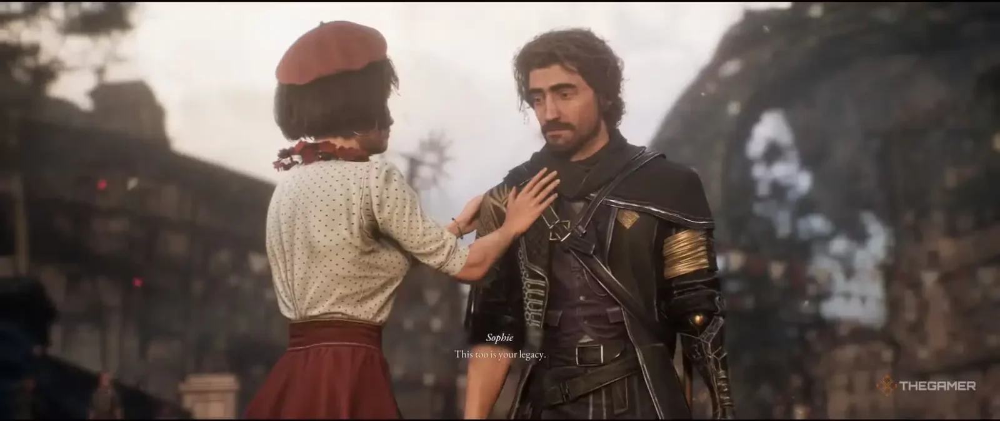

**משחק תפקידים טקטי מרהיב שמצליח להתרומם מעל ההשפעות שלו ולהותיר חותם משלו**

**🟢 זמינות:** PC, PlayStation 5, Xbox Series  
**📅 תאריך השקה:** 24 באפריל 2025  
**👤 PEGI 16**  
**🎮 מפתחת:** Sandfall Interactive  
**🕹️ מפיצה:** Kepler Interactive

## **עולם טרגי מלא בפואטיקה**

Clair Obscur: Expedition 33 שוזר סיפור קודר על עולם שגוסס – תרתי משמע. בכל שנה, ישות מסתורית בשם The Paintress מציינת גיל חדש – גיל מרבי לחיים, שמעליו האנשים פשוט נעלמים. העולם שלה, Lumière, מכוסה בצבעים עדינים, אורות מעורפלים ואסתטיקה שמזכירה את תקופת ה-Belle Époque, אבל מאחורי כל יופי יש נבואת חורבן.

המסע יוצא לדרך כשאתם מובילים קבוצת ניצולים שנבחרו למסע ה-33 שנשלח להשמיד את הישות. כל שאר המסעות כשלו. כל דמות נושאת עליה את מורשת העבר ואת הפחד מהעתיד. החיבור בין העלילה לדמויות, ולעולם הסובב אותן, נרקם בדיוק מרשים שמערב את השחקן רגשית כבר מהרגע הראשון.

https://www.youtube.com/watch?v=2VaLOc1FpSo&ab\_channel=PlayStation 

## **מערכת קרב תורית... מלאה חיים**

בניגוד למה שנהוג במשחקים תוריים, הקרבות ב-Clair Obscur מלאים דינמיקה, קצב ואתגר. בדומה ל-Persona או Like a Dragon, כל פעולה דורשת תשומת לב: לחיצות מדויקות לשיפור קסמים, התחמקויות בזמן אמת והתגוננויות קריטיות – שמונעות אסון ומייצרות התקפה חוזרת בסגנון קולנועי מרהיב.

כל דמות מביאה איתה מכניקה ייחודית – מגלף בקלפים שמאזן בין חושך לאור, דרך מכשפה שמשחקת עם אלמנטים, ועד לוחמת שמחליפה עמדות לפי תנאי הקרב. המערכות הללו מצטלבות זו בזו, ויוצרות עומק טקטי יוצא דופן. ככל שהמשחק מתקדם, הקרבות הופכים למורכבים יותר, ומרגישים כמעט כמו משחק קצב – בו כל טעות עולה ביוקר.

 

## **דמויות בלתי נשכחות**

מעבר למכניקה, חברי הקבוצה ב-Clair Obscur מעוצבים לעומק – גם מבחינת סיפור וגם בגיימפליי. לכל אחד ואחת יש עבר, מניעים ונקודת שבירה רגשית. הדיאלוגים כתובים היטב, ומשוחקים ברמה של סדרה איכותית. הקצב האינטימי בין רגעי פעולה לרגעים של שקט – ליד המדורה, במעברים – הופך את הדמויות לאנשים של ממש, כאלה שקל לאהוב או לחשוש עליהם.

 

## **הצגה תיאטרלית ופסקול עוצר נשימה**

המשחק מבוים ממש כמו הצגה – עם רגעי שתיקה דרמטיים, קומפוזיציות ציוריות, תנועות מצלמה אלגנטיות, וטון רגשי שמזכיר לעיתים יותר במה מאשר קולנוע. העיצוב האמנותי שואב השראה מהתרבות הצרפתית, ממוזיאונים ועד לאופרות – והמוזיקה תומכת בכל רגע כזה עם שילוב של מיתרים, מקהלות, רוק סימפוני וסינתים אווירתיים.

יש תחושה שהמשחק מבין היטב את כוחה של מוזיקה ביצירת רגש. גם בקרבות וגם בסצנות הסיפור, היא מצליחה להוביל את החוויה בלי לגנוב את הפוקוס – בדיוק כמו שצריך.

https://www.youtube.com/watch?v=ztbPkvqRiGg&list=PLI0\_h8FqQIs1YxZZyEMVOeB5UV6hOO8Ja&index=2&ab\_channel=SandfallInteractive

## **מחווה חכמה ל-JRPG קלאסיים**

Clair Obscur לא מסתיר את ההשראות שלו: Final Fantasy, Persona, אפילו Dragon Quest – אבל הוא לא נשען עליהן. הוא מבין _למה_ הן עובדות, ומשלב את האלמנטים הטובים ביותר מהן ליצירה עצמאית, מודרנית, אך גם נוסטלגית. העולם הגדול מזכיר את ימי האוויריות והצ'וקובו, בעוד החידות והמבוכים קלאסיים לגמרי – מבלי להרגיש מיושנים.

עם אורכו המדויק (כ-35 שעות לקו העלילה ועוד כ-20 לתוכן צדדי), Clair Obscur מצליח להיות ממוקד בלי לאבד עומק, עמוס רגש מבלי להיות מתיש, ויפהפה בלי להקריב משחקיות.

## **דרישות מערכת – PC**

**מינימום (1080p, 30FPS):**

- מערכת הפעלה: Windows 10
    
- מעבד: Intel Core i7-8700K / AMD Ryzen 5 1600X
    
- זיכרון RAM: 8GB
    
- כרטיס מסך: GTX 1060 / RX 5600 XT / Intel Arc A380
    
- דיסק: SSD עם 55GB פנויים
    

**מומלץ (1080p, 60FPS):**

- מערכת הפעלה: Windows 11
    
- מעבד: Intel Core i7-11700K / AMD Ryzen 5 5600X
    
- זיכרון RAM: 16GB
    
- כרטיס מסך: RTX 3060 Ti / RX 6800 XT
    
- דיסק: SSD עם 55GB פנויים
    

Clair Obscur: Expedition 33 הוא לא רק RPG מצוין – הוא יצירה מלאה נשמה, מחשבה, וקצב. הוא אולי לא מושלם, אבל הוא חד, ייחודי, ונכנס ישר ללב. משחק חובה לאוהבי הז’אנר – וגם לאלו שרוצים לגלות מחדש למה התאהבו בו מלכתחילה.
