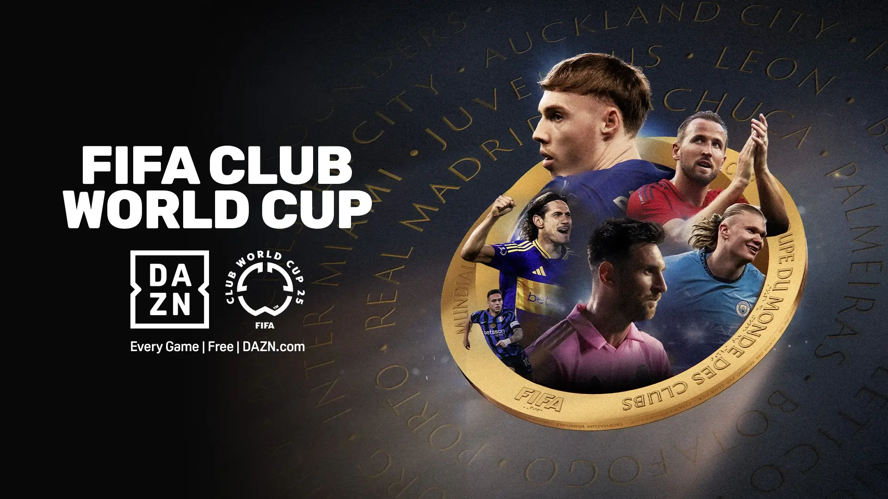
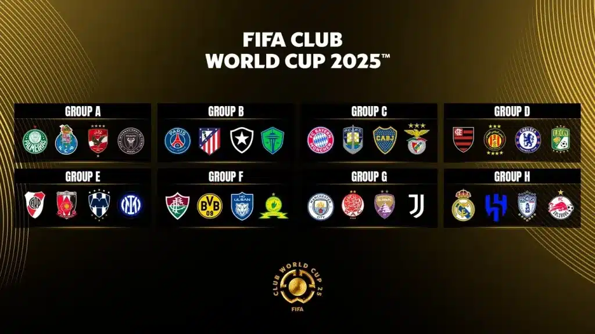

**טורניר גביע העולם למועדונים יוצא לדרך – 32 קבוצות, 1 תואר. הנה כל הדרכים לצפות בשידור חי בישראל: טלוויזיה, סטרימינג, וללא תשלום.**

## **📺 איך רואים את גביע העולם למועדונים בישראל?**

#### ✅ ערוצים זמינים:

- **ערוץ 5SPORT** – ישדר את כל המשחקים, כולל חצי גמר וגמר  
    זמין למנויי HOT, Yes, סלקום TV ופרטנר TV
    
- [**DAZN**](https://www.dazn.com/) – סטרימינג חוקי, זמין בחינם ברוב המדינות (דורש הרשמה פשוטה בלבד)
    

### **🛡️ טבלת השוואה**

| פלטפורמה | חינם | כל המשחקים? | איך לצפות |
| --- | --- | --- | --- |
| ערוץ 5SPORT (ישראל) | ❌ | ✅ | טלוויזיה ישראלית |
| DAZN (גלובלי) | ✅ | ✅ | הרשמה חינמית אונליין |

## **🌍****מי על המגרש? כל 32 הקבוצות בגביע העולם למועדונים 2025 לפי יבשת**

### **🇪🇺 אירופה (12 קבוצות) – האליטה העולמית**

ריאל מדריד (2022, 2024), מנצ'סטר סיטי (2023), צ'לסי (2021) מייצגות את צמרת הכדורגל.  
הצטרפו אליהן: פ.ס.ז' (אלופת אירופה 2025), באיירן מינכן, אינטר מילאן, פורטו, בנפיקה, בורוסיה דורטמונד, יובנטוס, אתלטיקו מדריד ורד בול זלצבורג.

###  **דרום אמריקה (6 קבוצות) – מלכי הליברטדורס**

פלמייראס (2021), פלמנגו (2022), פלומיננזה (2023) לצד בוקה ג'וניורס, ריבר פלייט ובוטפוגו – שמביאים סגנון דרמטי וטכני.

### **שאר העולם – הגיוון המלא**

- **אסיה**: אל הילאל, אוראווה רד דיימונדס, אולסן יונייטד, אל עין
    
- **אפריקה**: אל אהלי, ווידאד קזבלנקה, ממלודי סאנדאונס, אספרנס
    
- **צפון אמריקה**: מונטריי, פאצ'וקה, לאון, סיאטל סאונדרס
    
- **אוקיאניה**: אוקלנד סיטי
    
- **ארה"ב**: אינטר מיאמי (עם מסי) ו-LAFC
    

## **🗓 לוח המשחקים המלא – שלב הבתים**

## **📅 שארית שלב הבתים – כל המשחקים (הן היו עד ה־22 ביוני, והחיים ממשיכים)**

_(שעות לפי ישראל GMT+3)_

### **יום ראשון, 22 ביוני**

- **12:00** – יובנטוס (Juventus) 🆚 ווידאד קזבלנקה (Wydad AC)
    
- **15:00** – ריאל מדריד (Real Madrid) 🆚 פאצ'וקה (Pachuca)
    
- **18:00** – רד בול זלצבורג (RB Salzburg) 🆚 אל הילאל (Al Hilal)
    
- **21:00** – מנצ'סטר סיטי (Manchester City) 🆚 אל עין (Al Ain)
    

### **יום שני, 23 ביוני**

- **21:00** – סיאטל סאונדרס (Seattle Sounders) 🆚 פ.ס.ז' (Paris Saint-Germain)
    
- **21:00** – אתלטיקו מדריד (Atlético Madrid) 🆚 בוטפוגו (Botafogo)
    
- **03:00** – אינטר מיאמי (Inter Miami) 🆚 פלמייראס (Palmeiras)
    
- **03:00** – פורטו (FC Porto) 🆚 אל אהלי (Al Ahly)
    

### **יום שלישי, 24 ביוני**

- **21:00** – בנפיקה (Benfica) 🆚 באיירן מינכן (Bayern Munich)
    
- **21:00** – אולסדןHD (Auckland City) 🆚 בוקה ג'וניורס (Boca Juniors)
    
- **03:00** – אספרנס תוניס (Espérance de Tunis) 🆚 צ'לסי (Chelsea)
    
- **03:00** – פלאמנגו (Flamengo) 🆚 LAFC (Los Angeles FC)
    

### **יום שבת, 28 ביוני – תחילת שלב 1/8 (שמינית גמר)**

- **21:00** – מנצ'סטר סיטי (Manchester City) 🆚 מקום שני בקבוצה H
    
- **03:00** – אלוף קבוצה אחרת 🆚 סיים שני בקבוצה מתאימה
    

**_ימים נוספים:_**

- יום ראשון, 29 יוני – שני משחקי שמינית נוספים
    
- יום שני, 30 יוני – 2 משחקים נוספים בשמינית גמר
    

## **⚽ שלבים מתקדמים**

כעת הושלמה שלב הבתים ו־16 הקבוצות הטובות ביותר מוכנות להכרעה בזירה הנוקאאוט:

- שמינית גמר מתחיל ב־28–30 יוני
    
- רבע גמר: 4–5 יולי
    
- חצי גמר: 8–9 יולי
    
- גמר: ראשון, 13 יולי, 04:00 (שעון ישראל) – MetLife Stadium
    

## **🗺️ איפה זה קורה? – 12 אצטדיונים בארה״ב**

**הגמר ייערך באצטדיון MetLife בניו ג'רזי (82,500 מושבים).**  
משחק הפתיחה – ב־Hard Rock Stadium במיאמי.  
הכי קטן: Audi Field בוושינגטון (20,000 מושבים).  
הכי מפואר: Rose Bowl בלוס אנג'לס (90,000 מושבים).

**ערים מארחות מרכזיות**: ניו יורק, מיאמי, לוס אנג'לס, פילדלפיה, אטלנטה, וושינגטון, סיאטל, אורלנדו ועוד.

## **🏆 למה שווה לעקוב?**

- 32 מועדונים מהגדולים בעולם – ריאל מדריד, מנצ’סטר סיטי, אינטר מיאמי, באיירן, פ.ס.ז' ועוד
    
- כוכבים כמו ליאו מסי, ויניסיוס, האלאנד ופליפה אנדרסון
    
- פרס כספי עצום – כמעט 100 מיליון דולר
    
- אווירת מונדיאל – שלב בתים + נוקאאוט כמו ביורו
    

### **✅ סיכום מהיר**

- יש לכם טלוויזיה עם חבילת ספורט? ראו בערוץ 5SPORT
    
- רוצים לצפות בחינם מכל מכשיר? DAZN מציע שידורים בחינם עם הרשמה פשוטה
    
- כל המשחקים זמינים לצפייה חיה באיכות גבוהה
