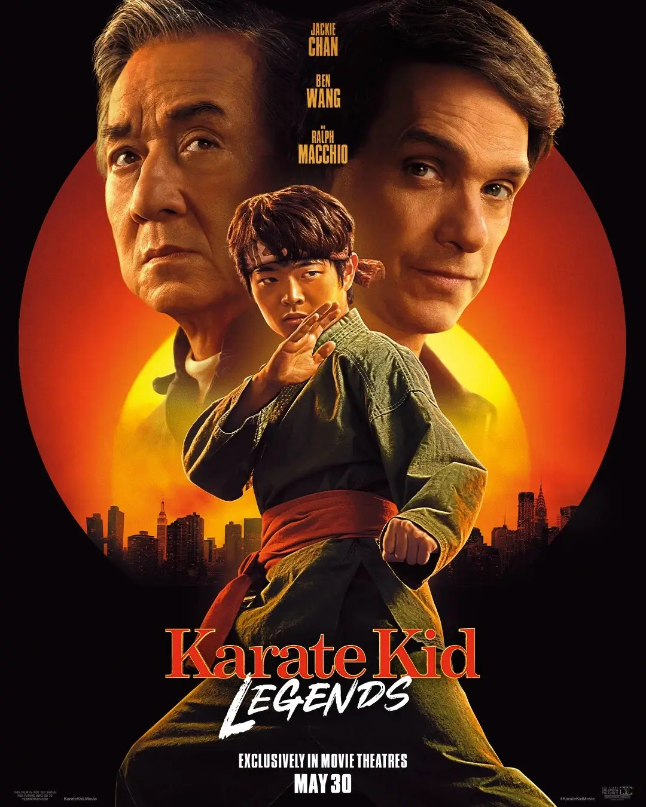

בעוד שהחלק השני של **Cobra Kai** זמין מאז נובמבר בנטפליקס, תצטרכו להתאזר בסבלנות לחלק השלישי של עונה 6, שהיא גם העונה האחרונה של הסדרה.

החדשות הטובות: עונה 6  כוללת 15 פרקים.  
החדשות הפחות טובות: העונה מחולקת ל-3 חלקים. לאחר חמישה פרקים ששוחררו בקיץ האחרון, החלק השני (שמציג דוג’ו חדש בשם **Iron Dragons**) זמין מאז ה-15 בנובמבר 2024. 
זה עדיין לא הסוף...

https://www.youtube.com/watch?v=TXzPaCbpAHc

## מתי יוצא החלק השלישי של עונה 6 של Cobra Kai?

ארבעה חודשים הפרידו בין החלק הראשון, שיצא ב-18 ביולי 2024, לחלק השני, שעלה ב-15 בנובמבר. פרק זמן לא קצר בכלל! האם נצטרך לחכות שוב כל כך הרבה? למזלנו, ההמתנה הפעם תהיה קצרה יותר, אבל עדיין תידרש סבלנות.

בסיום פרק 10, מופיע מסך בנטפליקס שמכריז על תאריך יציאת החלק השלישי של עונה 6: **13 בפברואר 2025**.

החלק האחרון יכלול **5 פרקים** בלבד.

## אין עונה 7 ל-Cobra Kai

לא תהיה עונה 7 ל-**Cobra Kai**. החלק השלישי של עונה 6 יהיה הסיום הרשמי של הסדרה, שרצה מאז 2018.

בנוסף, לא הוכרז על סדרת ספין-אוף נכון לעכשיו. עם זאת, ידוע כי יוצרי הסדרה הביעו עניין ליצור סדרת פריקוול שתתמקד בדמותו של **מיאגי**. למרות זאת, אי אפשר שלא לתהות גם על העתיד של הדוג'ואים האהובים עלינו.

## האם הסרט Karate Kid: Legends קשור ל-Cobra Kai?

סיום הסדרה לא אומר את סופו של ה-"Miyagi-verse". ראלף מאצ'יו יחזור לתפקיד הסנסיי שלו בסרט חדש, שכבר צולם וצפוי לצאת במהלך 2025 (כרגע מתוכנן ל-**20 במאי 2025**). תחילה, הסרט היה מתוכנן לתחילת השנה, אך נדחה כדי לפנות מקום לסיום הסדרה.

אז האם הסרט **Karate Kid: Legends** מהווה המשך ל-Cobra Kai?  
התשובה היא: **חלקית**. הסרט מתרחש באותו יקום, ויכלול את **לארוסו** לצד **מיסטר האן** (בגילומו של ג'קי צ'אן, מה שמכניס את הריבוט מ-2010 לקאנון של היקום).

ראלף מאצ'יו הדגיש באחת מראיונותיו כי **Karate Kid: Legends** מתרחש אחרי האירועים של **Cobra Kai**, כך שההמשכיות נשמרת. זהו לא ריבוט, אלא המשך ישיר ליקום. עם זאת, ייתכן שהסרט לא יזכיר במפורש את אירועי הסדרה, מאחר שמפיקי Cobra Kai לא מעורבים ביצירת הסרט.  
מלבד מאצ'יו בתפקיד לארוסו, נכון לעכשיו, אף אחד מחברי הקאסט של הסדרה לא הוכרז כחלק מ-Legends.

- Karate Kid: Legends ממשיך את היקום של Miyagi ומתרחש אחרי סיום Cobra Kai, עם ראלף מאצ'יו בתפקיד לארוסו.
- ג'קי צ'אן מצטרף לתפקיד מיסטר האן, מה שמאשר את שילוב הריבוט מ-2010 בקאנון של היקום.
- ללא צוות Cobra Kai: מפיקי הסדרה לא מעורבים, ולא ידוע אם דמויות נוספות יצטרפו לסרט.
