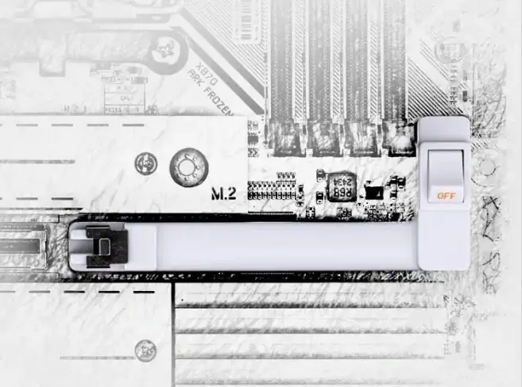

**Colorful מתכננת להשיק את לוח האם הראשון שלה בסדרת X870, תחת מותג CVN, עם מנגנון חדשני שמקל על הסרת כרטיסי מסך. האם זה הפתרון שכל הגיימרים חיכו לו?**

## **Colorful נכנסת סוף סוף לשוק לוחות האם X870**

למרות שיצרניות רבות כבר השיקו **לוחות אם עם ערכת השבבים X870/X870E** לתושבת AM5, Colorful לא השיקה דגמים משלה עד כה. כעת, לפי פוסט רשמי של החברה ב-Bilibili, נראה שהדגם הראשון מוכן לחשיפה תחת **סדרת CVN**.

אבל מה שבאמת מעניין כאן הוא לא רק **ערכת השבבים החדשה**, אלא מנגנון **הסרת כרטיסי המסך החדשני**, שיכול להקל על משתמשים רבים.

## **מנגנון הסרת כרטיסי מסך – איך זה יעבוד?**

Colorful מציגה מנגנון חדש שנועד **לפשט את תהליך החלפת כרטיסי המסך**, ולפי התמונות, הוא כולל **כפתור ייעודי ON/OFF להפסקת החשמל לחריץ ה-PCIe** לפני הוצאת הכרטיס.

- **היתרון העיקרי**: חיתוך החשמל לפני ההסרה יכול **למנוע נזק פוטנציאלי ללוח אם ולכרטיס המסך**, בעיקר במקרה של הפעלה בטעות בזמן הניתוק.
- **השוואה ל-ASUS**: ASUS הציגה בעבר את מנגנון _Q-release_, אבל משתמשים דיווחו על **בעיות טכניות שגרמו לחלק מלוחות האם שלהם להזדקק ל-RMA**. Colorful תצטרך לוודא שהיישום שלה **נטול תקלות** כדי להימנע מבעיות דומות.

אם המנגנון החדש **יעבוד בצורה חלקה**, הוא עשוי להפוך לסטנדרט חדש בלוחות אם מתקדמים.

## **ביצועים וקירור – מה עוד מצפה לנו?**

מעבר למנגנון החדש, לוח האם **CVN X870** צפוי להגיע עם כמה תכונות נוספות:

- **קירור "Frost Armor" על ה-VRM** – גופי קירור מסיביים שמיועדים לשמור על טמפרטורה נמוכה גם בעומסים כבדים.
- **תמיכה במעבדי AMD החדשים** לתושבת AM5, כולל Ryzen 9000 (לפי הערכות).
- **אפשרויות מתקדמות לאוברקלוקינג** – לוחות CVN של Colorful ידועים בתמיכה שלהם בהתאמות ביצועים למשתמשים מתקדמים.

## **מתי Colorful תשיק את הלוח החדש?**

נכון להיום, **אין עדיין תאריך השקה רשמי**, אך מאחר שהפוסט של החברה כבר רומז על דגם מוכן, ניתן להעריך שנראה אותו **במהלך המחצית הראשונה של 2025**.

## **האם זה לוח האם החדשני שחיכינו לו?**

Colorful נכנסת **באיחור יחסי** לשוק ה-X870, אבל עושה זאת **עם חידוש מסקרן** – מנגנון שיכול **להקל משמעותית על הסרת והתקנת כרטיסי מסך**.

אם היישום שלו יהיה **נטול תקלות**, זה עשוי להיות יתרון אמיתי למשתמשים **שמרבים להחליף כרטיסי מסך**, כמו גיימרים ואנשי חומרה.

השאלה היא – האם זה יהיה אמין יותר מהניסיון של ASUS, והאם Colorful תוכל לשכנע משתמשים לבחור דווקא בה על פני מותגים מבוססים יותר?
