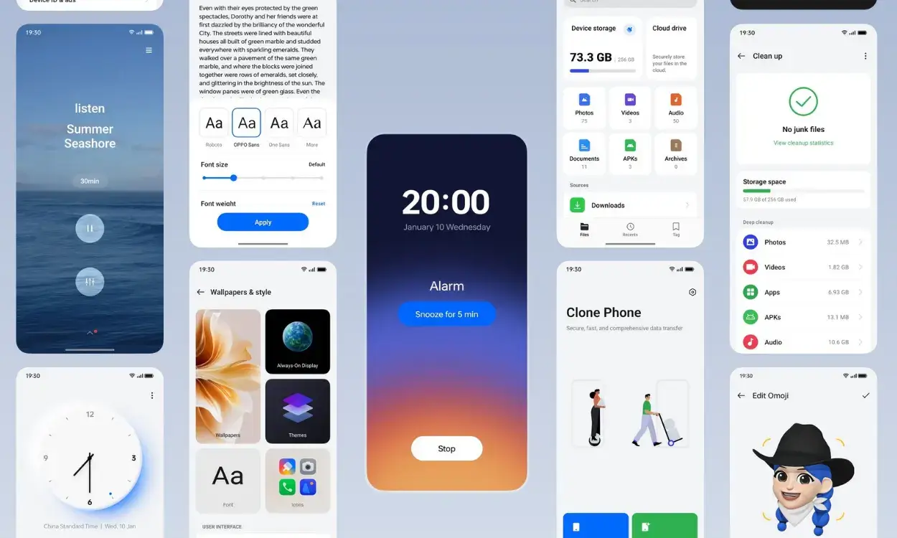

עדכון ColorOS 15 מביא איתו שיפורים רבים כמו אפשרויות התאמה אישית למסך הנעילה, אנימציות חלקות וכלים חכמים מבוססי AI. אין ספק שמשתמשי Oppo מצפים בקוצר רוח לעדכון שמבוסס על Android 15. בעקבות ההכרזה על ColorOS 15 שנסקרה במאמר הקודם שלנו ([לחצו כאן למעבר למאמר](https://techhorizons.co.il/oppo-coloros15/)), אנו יודעים היום יותר על לוח הזמנים והרשימה המלאה של המכשירים התומכים.

## ColorOS 15: מכשירים תומכים

החשבון הרשמי של ColorOS שיתף (דרך X) את לוח הזמנים הרשמי להשקת העדכון. הרשימה מספקת מבט רחב על כל המכשירים שיקבלו את העדכון החדש. עם זאת, מכיוון שהמידע שותף על ידי החשבון הגלובלי, לא ברור כיצד הוא מתורגם לפי אזורים, שכן ישנם מכשירים מסוימים הזמינים רק באזורים מסוימים ולא באופן גלובלי.

> We're rolling out 👇[#OPPOColorOS15](https://twitter.com/hashtag/OPPOColorOS15?src=hash&ref_src=twsrc%5Etfw) [pic.twitter.com/3Bidj4Wg8W](https://t.co/3Bidj4Wg8W)
> 
> — ColorOS (@colorosglobal) [November 22, 2024](https://twitter.com/colorosglobal/status/1859839277825393129?ref_src=twsrc%5Etfw)

**Oppo Find Series**

- Oppo Find N3
- Oppo Find N3 Flip
- Oppo Find N2 Flip
- Oppo Find X5 Pro
- Oppo Find X5

**Oppo Reno Series**

- Oppo Reno 11 Pro 5G
- Oppo Reno 12 Pro 5G
- Oppo Reno 12 FS 5G
- Oppo Reno 12 FS
- Oppo Reno 12 F 5G
- Oppo Reno 12 F
- Oppo Reno 11 5G
- Oppo Reno 11 F 5G
- Oppo Reno 11 FS
- Oppo Reno 11 A
- Oppo Reno 10 Pro+ 5G
- Oppo Reno 10 Pro 5G
- Oppo Reno 10 5G
- Oppo Reno 8 T 5G
- Oppo Reno 8 T

**F series**

- Oppo F27 Pro 5G
- Oppo F25 Pro 5G
- Oppo F23 5G

**K Series**

- Oppo K12x 5G

**Oppo Tablets**

- Oppo Pad 3 Pro
- Oppo Pad 2

Oppo פרסמה באתר הרשמי שלה את לוח הזמנים הרשמי להשקת עדכון ColorOS 15. ריכזנו עבורכם את המידע החשוב כאן, כדי שתדעו מתי המכשיר שלכם יקבל את העדכון.

**נובמבר 2024:**

- Oppo Find N3
- Oppo Find N3 Flip
- Oppo Reno 11 Pro 5G

**דצמבר 2024:**

- Oppo Reno 12 Pro 5G
- Oppo Reno 12 5G
- Oppo Reno 12 FS 5G
- Oppo Reno 12 F 5G
- Oppo Reno 11 5G
- Oppo Reno 11 F 5G
- Oppo K12X 5G
- Oppo F27 5G
- Oppo F25 Pro 5G
- Oppo Pad 3 Pro
- Oppo Pad 2

**רבעון ראשון 2025:**

- Oppo Find N2 Flip
- Oppo Find X5 Pro
- Oppo Find X5
- Oppo Reno 11 A
- Oppo Reno 10+ Pro 5G
- Oppo Reno 10 Pro 5G
- Oppo Reno 10 5G
- Oppo F27 Pro+ 5G

**רבעון שני 2025:**

- Oppo Reno 12 FS
- Oppo Reno 12 F
- Oppo Reno 11 FS
- Oppo Reno 8T 5G
- Oppo Reno 8T
- Oppo F23 5G

כפי שניתן לראות, המכשירים החדשים יותר כמו Find N3, N3 Flip ו-Oppo Reno 11 Pro 5G היו הראשונים לקבל את העדכון האחרון. לאחר מכן, סדרת Reno 12 קיבלה את העדכון בדצמבר 2024, וכעת מכשירים נוספים צפויים ליהנות מהגרסה החדשה. אם המכשיר שלכם לא מופיע ברשימה, ייתכן שהוא יקבל את העדכון במועד מאוחר יותר.

- המכשירים החדשים Oppo Find N3, N3 Flip ו-Reno 11 Pro 5G קיבלו את העדכון הראשונים.
- סדרת Reno 12 התחילה לקבל את ColorOS 15 בדצמבר 2024, ועדכונים נוספים צפויים בהמשך.
- מכשירים שאינם ברשימה עשויים לקבל את העדכון במועד מאוחר יותר.
