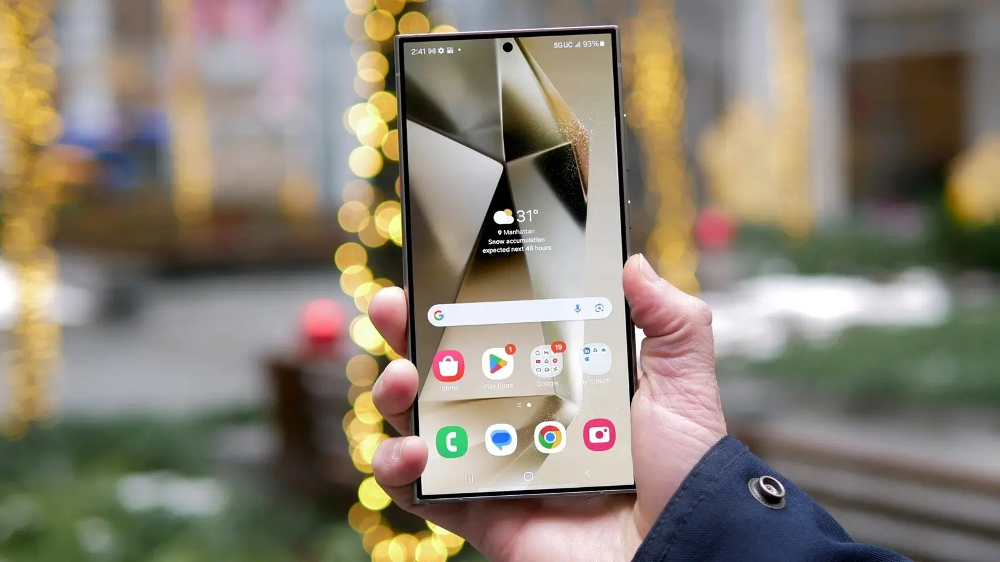
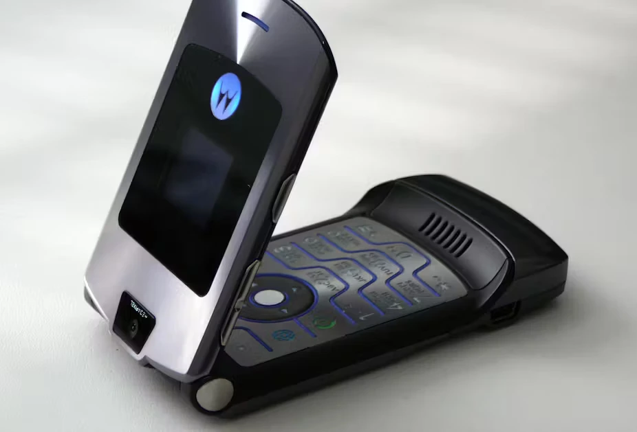
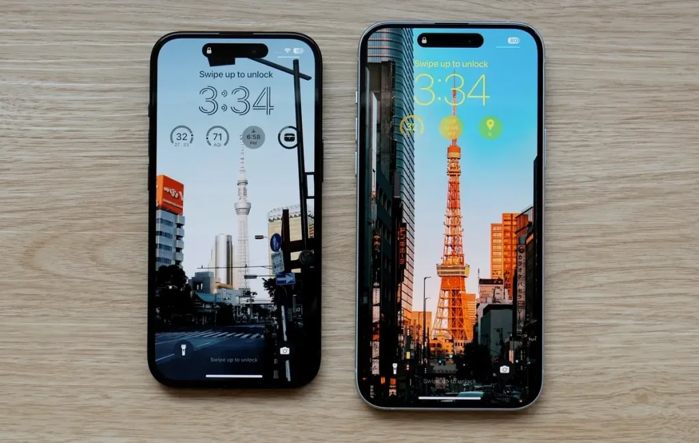

בכל שנה, מיליוני מסכי סמארטפונים מסיימים את חייהם בסדקים, שברים והתנפצויות. נפילה קטנה, כיס פתוח מדי או תזוזה חדה מהמיטה – וזהו, המסך גמור. במשך יותר מ־15 שנה, Corning הייתה זו ששמרה על המסכים שלנו עם סדרת **Gorilla Glass** שנכנסה כמעט לכל סמארטפון מוביל. עכשיו היא עוברת שלב – עם זכוכית חזקה מאי פעם.

## **מה זה בעצם Gorilla Glass Ceramic?**

ההכרזה האחרונה של Corning מדברת על זכוכית חדשה בשם **Gorilla Glass Ceramic** – חומר היברידי שמערבב את השקיפות של זכוכית עם העמידות הפיזית של קרמיקה. לפי החברה, בזמני ניסוי במעבדה, הזכוכית הזו שרדה **10 נפילות מגובה מטר על אספלט**, לעומת זכוכיות רגילות שנשברו כבר מהנפילה הראשונה.

## **Motorola שוב מפתיעה עם ראשוניות טכנולוגית**

**Motorola** תהיה היצרנית הראשונה שתשלב את הזכוכית החדשה באחד מהסמארטפונים הקרובים שלה. ייתכן שזה יהיה הדגם הבא של **Razr**, הטלפון המתקפל שמסמן את הקאמבק של החברה.

וזה לא מקרה: למרות שמוטורולה מזוהה אצל רבים עם טלפונים ישנים ומכשירי קשר, היא נחשבת כיום לאחת היצרניות החדשניות ביותר. ממסכים מתקפלים ועד חיישנים מתקדמים – היא ממשיכה לחדש.

## **האם מדובר בתגובה ל־Ceramic Shield של Apple? ומה עם iPhone בלתי שביר?**

מאז 2020, Apple משתמשת בזכוכית בשם **Ceramic Shield**, שפותחה יחד עם Corning ונחשבת לעמידה במיוחד. אבל בואו נהיה כנים: **כמה מכם לא שברו מסך או גב של אייפון מנפילה קטנה מדי פעם?** וכמה זה עלה לכם בתיקון?

ההכרזה של Corning על Gorilla Glass Ceramic יוצרת שאלה מתבקשת:  
**אם Corning היא זו שמייצרת גם את הזכוכית של Apple – מתי נראה סוף־סוף אייפון באמת בלתי שביר?**

נכון לעכשיו, Corning משיקה מוצר עצמאי שמיועד **אך ורק למכשירי אנדרואיד**, עם מבנה קרמי חדש שאינו תלוי בשותפות עם Apple. המהלך הזה עשוי להוזיל עלויות, להרחיב את השימוש גם למכשירים פחות יוקרתיים – ואולי, דווקא בגלל זה, **ה-iPhone יישאר מאחור לפחות זמנית.**

השאלה הגדולה: האם Apple תאבד את היתרון שנתנה לה השותפות עם Corning, או שבקרוב גם ה־Ceramic Shield ישודרג?

### **השוואת מסכים: איך זה עומד מול הדגמים הקיימים?**

| דגם | סוג זכוכית | רמת עמידות מוכרת | תוספות |
| --- | --- | --- | --- |
| **iPhone 15 Pro** | Ceramic Shield (Apple + Corning) | גבוהה מאוד | מוגן היטב בנפילות אך רגיש לשריטות |
| **Galaxy S24 Ultra** | Gorilla Glass Armor | גבוהה מאוד + אנטי־רפלקציה | ציפוי אנטי־רפלקטיבי משופר |
| **Pixel 8 Pro** | Gorilla Glass Victus 2 | גבוהה | עמידות טובה אך פחות מקרמיקה |
| **Motorola à venir** | Gorilla Glass Ceramic | אמור להיות העמיד ביותר | טרם נבדק עצמאי |

לפני שאתם שואלים – הנה איך Gorilla Glass Ceramic החדש משתווה לחלופות הקיימות בשוק. הטבלה מציגה את סוג הזכוכית, כמה היא עמידה בפועל, ומה התוספות שכל יצרן מביא למסך שלו – כי לא כל "זכוכית חזקה" היא באמת אותו הדבר.

## **מה מקבלים – ומה פחות?**

הזכוכית החדשה מביאה **עמידות גבוהה מאוד לנפילות**, אבל בשלב זה לא כוללת את הציפוי נגד השתקפויות שמופיע ב־Armor. מדובר בזכוכית שתהיה כנראה **זולה יותר ליישום**, מה שעשוי להרחיב את השימוש בה למכשירים רבים יותר – לא רק דגמים יוקרתיים.

## **עולם הזכוכית הופך לזירת קרב**

**Corning** עדיין נחשבת לשם הכי חזק בעולם הזכוכית לסמארטפונים – אבל היא כבר לא לבד. יצרניות כמו **Schott** הגרמנית ו־**Doogee** הסינית מפתחות גם הן פתרונות היברידיים עמידים, וחלקם כבר מופיעים במכשירים מסחריים.

השוק הזה נעשה **תחרותי מתמיד**, וההשקה של Gorilla Glass Ceramic נועדה לא רק להציג חידוש – אלא גם **להחזיר את Corning לעמדה מובילה באנדרואיד**.

ומה זה אומר עבורנו, המשתמשים? פשוט מאוד:  
**ככל שיש יותר מתחרים, יש יותר חדשנות, יותר דגמים לבחור מהם – ופחות סיכוי שתשלמו מאות שקלים על תיקון מסך שבור.**

## **בשורה אמיתית – או עוד ספין שיווקי?**

כמו תמיד, דברי שיווק לא מספיקים. **Corning** מציגה את הזכוכית החדשה כ"פריצת דרך אמיתית", אבל בשלב זה **אין עדיין מבחנים עצמאיים** שמוכיחים עמידות לאורך זמן, נפילות אמיתיות או שריטות מחיי היום־יום.

השאלות האמיתיות יגיעו **כשהמכשירים הראשונים עם Gorilla Glass Ceramic ינחתו בידיים של משתמשים רגילים**, עם מפתחות בכיס ומרצפות בבית.

ואם שאלתם את עצמכם – לא, **גם הזכוכית החדשה כנראה לא תשרוד אם טנק מרכבה יעלה לכם על הטלפון בטעות**. בואו נישאר ריאליים.
