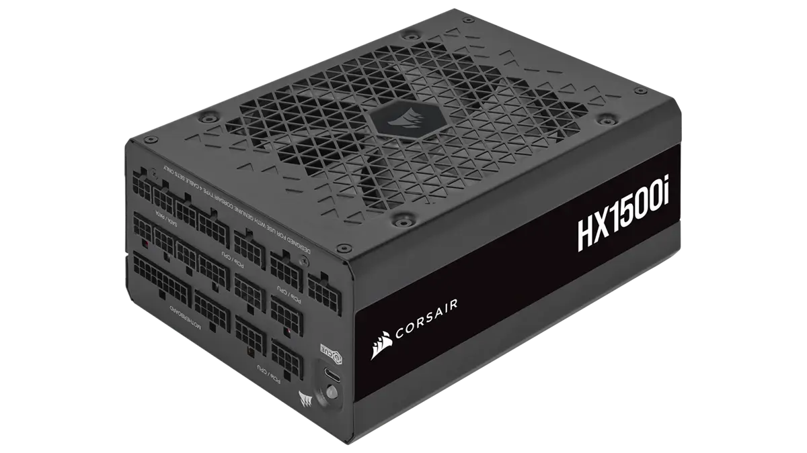
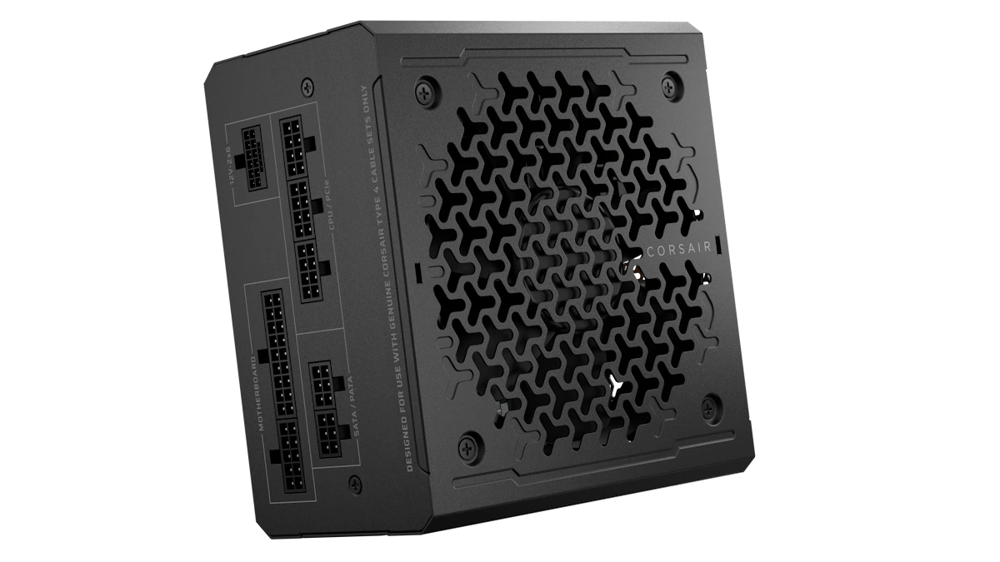
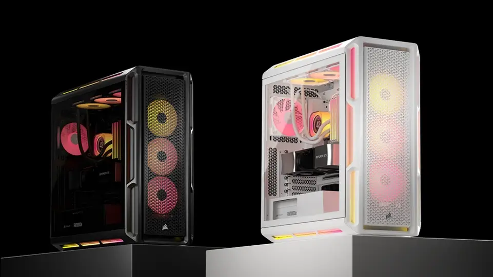
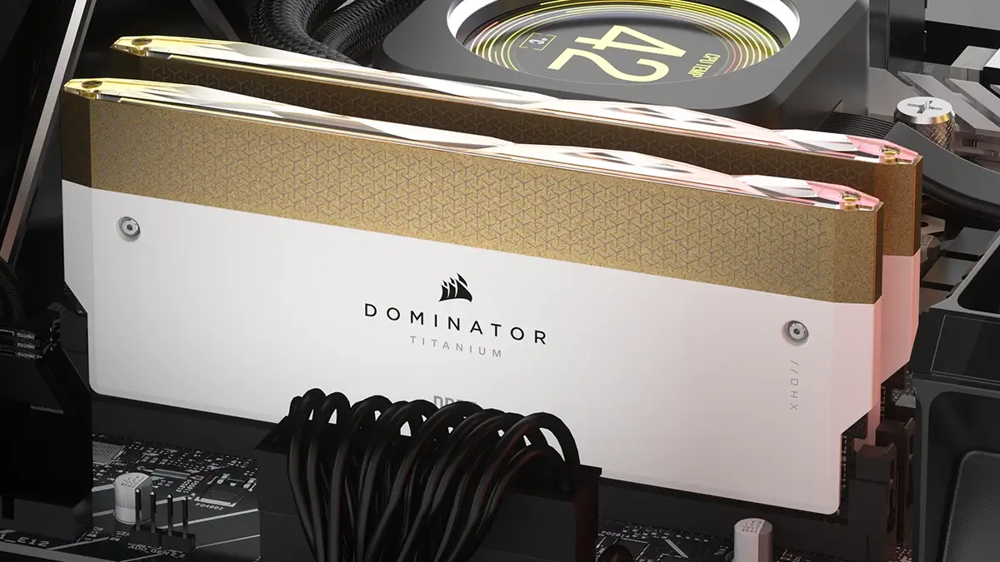
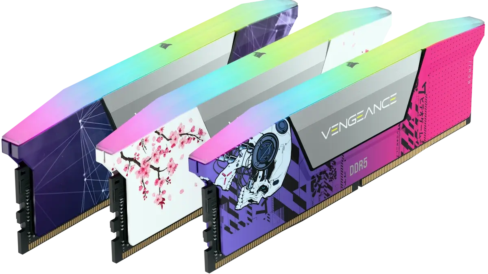
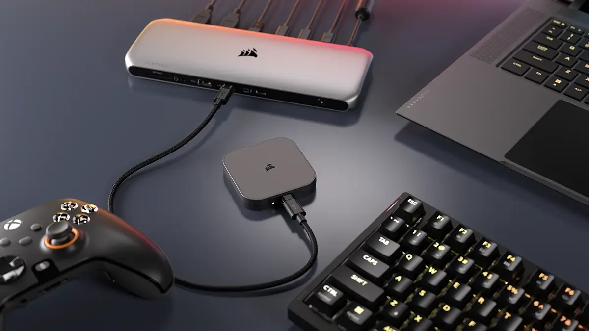
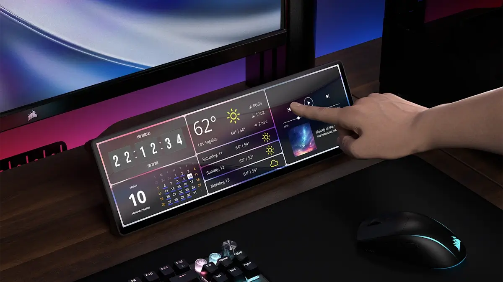

אחד היצרנים המובילים בעולם החומרה למחשבים, Corsair, ניצל את CES כדי להכריז על סדרת מוצרים חדשה המיועדת לחובבי טכנולוגיה. הקו החדש כולל שבע קטגוריות שונות של מוצרים, המותאמות לצרכים של גיימרים ויוצרי תוכן.

## סדרות ספקי הכוח RMe ו-HXi

סדרת ספקי הכוח RMe של Corsair זוכה לשדרוג משמעותי עם גרסת RMe 2025. גרסה זו כוללת דגמים בהספקים של 650W, 750W, 850W ו-1000W. כל ספק כוח בסדרה זו מצויד בחיבורי 12V-2x6 ותומך בכרטיסי המסך מסדרות NVIDIA RTX 40 וגם RTX 50 שהושקו לאחרונה.

 

Corsair מעדכנת גם את סדרת ספקי הכוח HXi, המיועדת למשתמשים מתקדמים שדורשים הספקים גבוהים. הדגמים HX1200i ו-HX1500i מיועדים למערכות מתקדמות במיוחד. העדכונים יושקו במהלך הרבעון השני ויכללו חיבורי 12V-2x6 התומכים בכרטיסי המסך החדשים של NVIDIA ו-AMD.  
ספקי הכוח בסדרה זו מצוידים בדירוג Plantium CYBENETICS ומציעים עד 92% יעילות אנרגטית. שתי הסדרות, RMe ו-HXi, זמינות כבר עכשיו לרכישה דרך Corsair.

## סדרת 5000T Mid-Tower: שדרוגים למבנה ולתאימות

Corsair ממשיכה להרחיב את קטלוג המארזים שלה עם הוספת סדרת 5000T Mid-Tower, שמציעה שדרוגים לעומת הדגמים הקיימים. המארזים החדשים מותאמים ללוחות אם ללא חיבורים גלויים (Connector-less), כמו ASUS BTF, GIGABYTE Project Stealth, ו-MSI Project Zero, ותומכים בהם ישירות מהקופסה.

בסדרה שתי גרסאות:

- **iCUE Link 5000T LX RGB**: כוללת תאורת Aurora RGB, מספר מאווררי LX120 RGB, ומרכזת iCUE Link לחיבור ושליטה נוחים.
- **גרסה ללא RGB**: מיועדת למשתמשים שרוצים להוסיף מאווררים או רכיבים לפי בחירתם, עם או בלי תאורה.

המארזים מצוידים במערכת ניהול כבלים RapidRoute המאפשרת ניהול כבלים קל ונוח, וכוללים מרווחים גדולים להרכבה קלה ומהירה של המערכת.

## Corsair Custom LAB DRAM: התאמה אישית למראה ייחודי

 

Corsair מציגה שדרוג ל-Custom Lab DRAM, המאפשר התאמה אישית מלאה של זיכרונות RAM למראה מרהיב. משתמשים יכולים לבחור את קיבולת הזיכרון, המהירות והשהייה לפני התאמת המראה החיצוני של המודולים.

**Dominator TITANIUM Wave Accessory Kit**  
בנוסף, Corsair מוסיפה ערכת Top-Bar שנייה לזיכרונות DOMINATOR TITANIUM DDR5. הערכה מעניקה לזיכרונות המתקדמים הללו מראה יוקרתי ואלגנטי, המתאים לביצועים הגבוהים שהם מספקים.

## חומרה ואביזרים נוספים מבית Corsair

מלבד החומרה המרכזית ומערכות השדרוג שלה, Corsair הכריזה על שני מוצרים נוספים שמשדרגים את חוויית המשתמש:

### **EX400U USB4 External SSD**

כונן SSD חיצוני חדש המציע מהירויות קריאה וכתיבה רציפות של עד 4000 MB/s ו-3600 MB/s. ה-EX400U יהיה זמין לרכישה החל מה-23 בינואר, בגרסאות של 1TB, 2TB ו-4TB.

### **XENEON EDGE מסך מגע LCD בגודל 14.5 אינץ'**

מסך המגע החדש מציע רזולוציה של 2560x720p ומשלב פונקציות מתקדמות לשליטה ביישומים. המסך כולל אפשרויות חיבור כמו USB Type-C DP-Alt ויציאת HDMI, ומיועד לשיפור פונקציונליות בשימוש יומיומי. המוצר יהיה זמין במהלך הרבעון השני של 2025.

- Corsair חשפה סדרות חדשות של ספקי כוח RMe ו-HXi, עם תמיכה ב-GPUs של סדרת RTX 50.
- מארזי 5000T Mid-Tower מציעים תאימות ללוחות אם ללא מחברים ועיצוב מותאם לניהול כבלים.
- זיכרונות Custom LAB DRAM מאפשרים התאמה אישית מלאה של קיבולת, מהירות ועיצוב המודול.
- ה-EX400U USB4 SSD החיצוני מספק מהירויות קריאה וכתיבה של עד 4000 MB/s ויהיה זמין החל מה-23 בינואר.
- מסך המגע XENEON EDGE בגודל 14.5 אינץ' כולל רזולוציה מתקדמת ושליטה חכמה, וזמין ברבעון השני של 2025.
