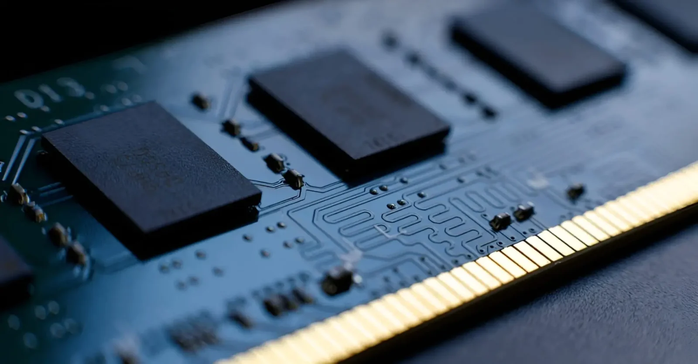

**סין פותחת חזית חדשה בעולם החומרה – והפעם בזיכרון.**

חברת **CXMT (ChangXin Memory Technologies)**, יצרנית ה־DRAM הגדולה ביותר בסין, הודיעה על **סיום ייצור DDR4** והתמקדות בטכנולוגיות מתקדמות:  
**DDR5** לזיכרון רגיל מהיר יותר ו־**HBM3** לזיכרון עוצמתי עבור AI ומעבדים גרפיים.

## **🔁 סוף עידן DDR4 – ומעבר ל־DDR5 בקנה מידה עצום**

CXMT הודיעה על הפסקת ייצור DDR4 והכרזה על סיום החיים של הטכנולוגיה עד סוף הרבעון הראשון של 2025. 
החברה מתכננת לייצר עד **280,000 פרוסות סיליקון (wafers)** לחודש – מה שיאפשר לה **לספק עד 15% מהשוק העולמי של DRAM**.

לשם השוואה, זהו נתח שוק עצום עבור חברה שנמצאת תחת מגבלות סחר ואינה מחזיקה בטכנולוגיות מערביות מלאות.

## **⚠️ בעיות איכות ראשוניות – אך עם פוטנציאל משמעותי**

נכון לעכשיו, CXMT מתקשה להגיע לאיכות ייצור מספקת:

- תשואת הייצור (yield rate) נמוכה
    
- ביצועים לא יציבים בטמפרטורות גבוהות
    
- לקוחות סיניים עברו למתחרות מקוריאה
    

למרות זאת, מקורות בתעשייה מעריכים ש־CXMT תפתור את מרבית הבעיות **עד סוף 2025**.

## **🧠 HBM3 – הקרב האמיתי נמצא בזיכרון ל־AI**

מעבר ל־DDR5, CXMT מפתחת **פתרון HBM ברמה גבוהה**, ככל הנראה HBM3.

- זוהי טכנולוגיית זיכרון שמאפשרת **העברת מידע במהירות גבוהה במיוחד**
    
- חיונית במיוחד למאיצי AI, שרתים, GPU ולרכבים אוטונומיים
    
- אם Huawei תוכל לרכוש HBM3 מתוצרת מקומית – היא תוכל **לדלג על הסנקציות האמריקאיות**
    

## **🧭 מה כל זה אומר עבורנו?**

גם אם אינכם מהנדסי חומרה, המהלך של CXMT עשוי להשפיע על חייכם באופן ישיר:

### **✔️ תחרות = ירידת מחירים**

אם CXMT תצליח למכור DDR5 זול יותר, יצרניות כמו Samsung ו־SK Hynix ייאלצו להוריד מחירים.  
**המחשבים, הטלפונים וקונסולות המשחק עלולים להפוך זולים יותר.**

### **✔️ יותר עצמאות טכנולוגית לסין**

סין כבר לא תלויה רק בארה"ב או דרום קוריאה. זהו **שלב חשוב בהתנתקות מטכנולוגיה מערבית**, עם השלכות כלכליות־פוליטיות מרחיקות לכת.

### **✔️ שליטה בזיכרון = שליטה ב־AI**

מאיצים כמו ChatGPT או Gemini זקוקים ל־HBM.  
אם לסין תהיה שליטה באספקה – היא תקבע את הקצב בתחום ה־AI הגלובלי.

## **🔚 סיכום**

CXMT עוד לא שווה לאיכות של Samsung או Micron – אבל עם קצב הייצור הנוכחי, התמיכה הממשלתית והפוקוס על AI, היא יכולה להפוך ל**שחקנית עולמית מרכזית כבר מ־2026**.
