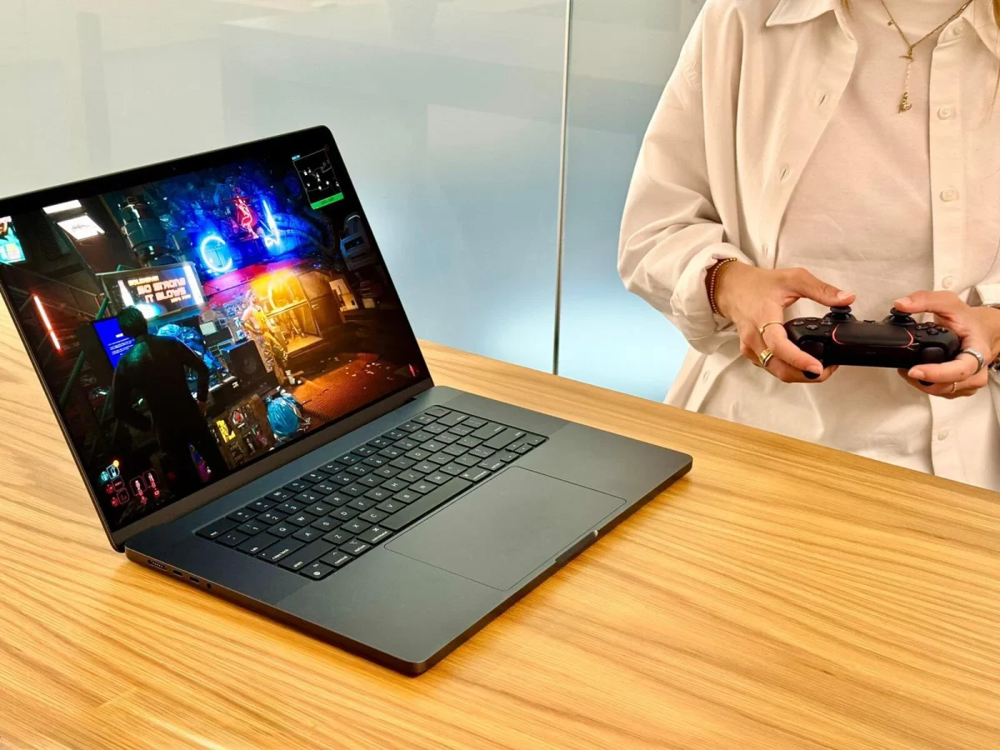

**🔥 Cyberpunk 2077 יוצא רשמית למק ב-18 ביולי — והדרישות? קשוחות מאוד.**  
אם יש לכם MacBook עם 8GB זיכרון — תצטרכו לשכוח מ-Night City.  
המשחק המפורסם של CD Projekt RED מגיע סוף סוף ל-macOS, עם דרישות מינימום גבוהות ושימוש מאסיבי בטכנולוגיות כמו MetalFX ו-ray tracing.

## **💻 צריך לפחות 16GB RAM: רוב המחשבים מחוץ למשחק**

הדרישה הבסיסית להפעלת המשחק: **16GB זיכרון אחוד (Unified Memory)**.  
משמעות: רוב ה-MacBook Air וה-Mac mini עם 8GB פשוט לא יצליחו להריץ את המשחק בכלל — אפילו לא ברזולוציה נמוכה.

🧠 למה? Cyberpunk 2077 תמיד היה משחק כבד במיוחד. גם בגרסת המק האופטימלית, מדובר במפלצת גרפית עם צריכת משאבים גבוהה.

## **📦 נפח התקנה: עד 159GB (!)**

- גרסת Steam / GOG / Epic: **92GB**
    
- גרסת Mac App Store: **159GB**
    

⚠️ תצטרכו macOS 15.5 ומעלה בשביל להריץ את המשחק.

## **🧮 דרישות מערכת: כל הקונפיגורציות**

CD Projekt RED פרסמה טבלת ביצועים לפי סוגי המק:

| מצב | חומרה | רזולוציה / FPS | טכנולוגיה |
| --- | --- | --- | --- |
| מינימום | M1 + 16GB | 1600x900 / 30FPS | MetalFX |
| מומלץ | M3 Pro + 18GB | 1920x1080 / 60FPS | MetalFX |
| איכות גבוהה | M2 Ultra / M3 Max + 36GB | 2560x1440 / 60FPS | MetalFX |
| איכות מקסימלית | M3 Ultra / M4 Max + 36GB | 2560x1440 / 60FPS | ray tracing |

## **Ray tracing: רק למחשבים העוצמתיים**

אם אתם רוצים לשחק עם Ray Tracing (הצללות, השתקפויות, אור ריאליסטי) — תצטרכו **לפחות M3 Pro עם 18GB**.  
ואם אתם מכוונים ל-60FPS, תצטרכו **M3 Max עם 36GB**.

זו דרישה כבדה, אבל לא מפתיעה — אפילו ב-PC צריך GPU ייעודי חזק בשביל זה.

## **🧪 MetalFX: הקסם של Apple**

כל הגרסאות משתמשות ב-**MetalFX**, מנוע הסקיילינג של אפל (דומה ל-DLSS של Nvidia):  
🔍 המשחק רץ ברזולוציה נמוכה יותר → ואז MetalFX "ממציא" פיקסלים כדי לדמות תמונה חדה יותר.

🎯 פתרון חכם לחסוך משאבים, אבל תלוי מאוד בכוח של המעבד וה-GPU.

## **💸 כמה זה עולה לנו?**

לשחק כמו שצריך ב-Cyberpunk 2077 על מק עולה ביוקר:

- **MacBook Pro עם M3 Pro ו-18GB RAM** – מעל **₪8,500** בישראל
    
- **M3 Max עם 36GB RAM** – עלול להגיע ליותר מ-**₪12,000**
    

✅ החדשות הטובות: אם כבר רכשתם את המשחק ב-PC, תקבלו את גרסת המק **בחינם** – ללא תשלום נוסף.

## **🚗 מה חדש בגרסת המק?**

- עדכון 2.3 עם רכבים חדשים
    
- מצב צילום מתקדם
    
- **Phantom Liberty** כלול
    
- תמיכה בשמירות חוצות פלטפורמות
    

## **🎯 סיכום מהיר**

- 🧠 דרישה בסיסית: 16GB RAM, macOS 15.5 ומעלה
    
- 🗃️ שטח פנוי: 92–159GB
    
- 🌈 Ray tracing – רק למקבוק פרו הכי יקרים
    
- 🎁 הגרסה ניתנת בחינם אם כבר קניתם אותה ב-PC
    
- 💰 ציוד מתאים = השקעה כבדה מאוד
